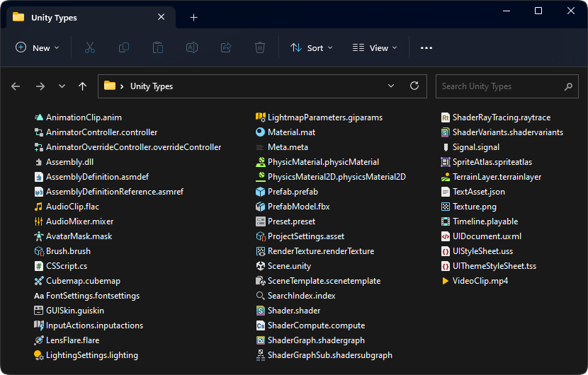
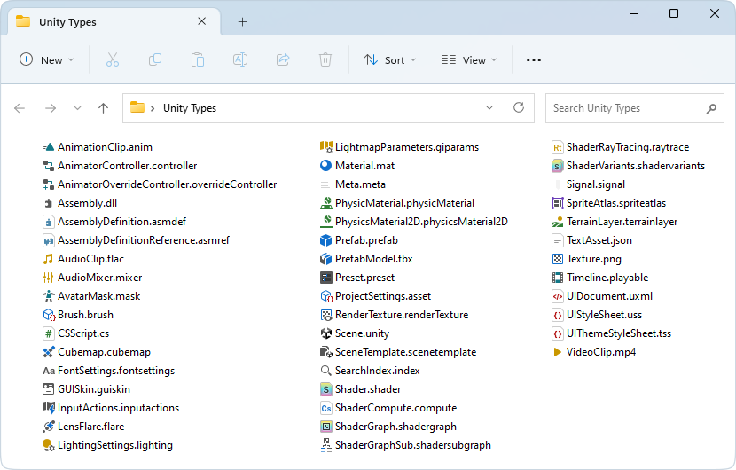

# Unity Icons for Windows Explorer

Are you tired of looking into blank files while working on your favorite Unity project? How many times have you sent a wrong file to the company's production pipeline because you couldn't properly identify what is what on the commit list? Well your problems are no more!

Jokes aside, this project provides Unity icons to be viewed within the Windows Explorer and help developers and artists work better and prevent mistakes, specially when checking the version control changes list before commiting on most popular programs like [TortoiseSVN](https://tortoisesvn.net), [TortoiseGIT](https://tortoisegit.org) or [Plastic SCM](https://www.plasticscm.com).

Most of the icons are 1:1 copies of the originals, but there are some exceptions:
- A `meta` icon, not originally provided by Unity, was designed to not draw too much attention from the main files and be almost invisible while still showing it is there and your GUIDs are safe.
- Some of the icons have a modded version more faithful to the color palette; feel free to mix and match to your heart's content.
- You may not see changes to some file types if you already have programs associated with them (e.g., image files); check the [known issues](#known-issues) section below for a fix.

PS: The icons have nothing to do with the selected theme on Unity, or whether a PRO license is being used or not. They are just icons.

## Install

Download the ZIP file from the [latest release](https://github.com/convalise/unity-icons-for-windows-explorer/releases/latest).

Copy the `UnityIcons` folder to the root of the C drive (i.e., the final path should be `C:\UnityIcons`).

Then run the desired REG install script:
- If Windows Dark Theme is being used, installing the dark theme icons is preferred.
- If Windows Light Theme is being used, installing the light theme icons is preferred.

After installation you may need to reset the icon cache (run the provided CMD script) or manually restart the Windows Explorer for the changes to take effect.

The REG file will: create specific file extensions in the registry and associate them to an icon.\
The REG file will NOT: change program associations or make files executable (i.e., double-clicking them won't open anything).

Before (dark theme) | After (dark theme)
:--|:--
 | 

Before (light theme) | After (light theme)
:--|:--
 | 

## Uninstall

The provided uninstallation REG script can be used to remove the custom icons associations.

## Known Issues

As mentioned before, some files like image or audio ones may not have their icons changed due to being associated with a program (thus using the icon provided by that program). For cases like this a little program called [Types by Evgeny Strunnikov](https://ystr.github.io/types) can be used. Just select the file type you want (e.g., mp3) and point to an icon provided by this icon pack (e.g., audioclip).

## Credits

This project was created by Conrado (https://github.com/convalise).
