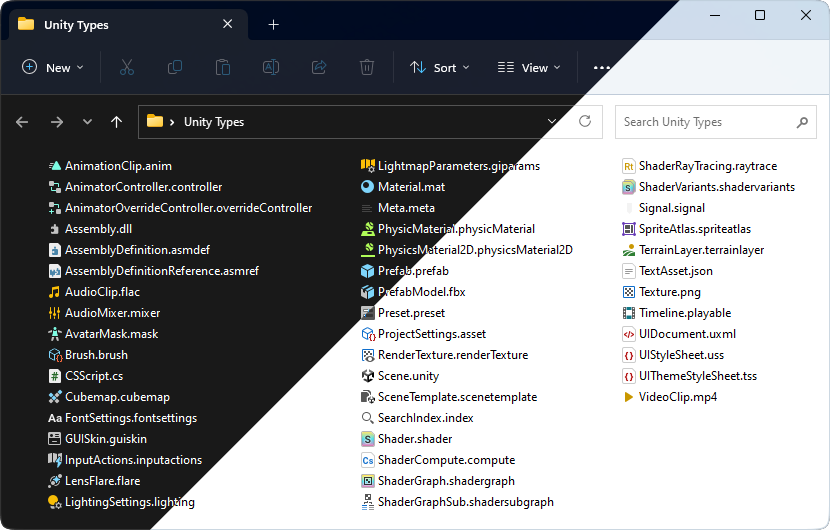
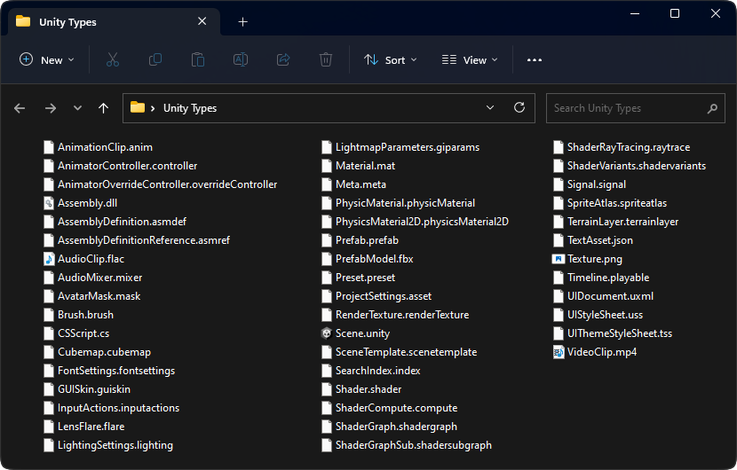

# Unity Icons for Windows Explorer

Are you tired of looking into blank files while working on your favorite Unity project? How many times have you sent a wrong file to the company's production pipeline because you couldn't properly identify what is what on the commit list? Well your problems are no more!

Jokes aside, this project provides Unity icons to be viewed within Windows Explorer and applications which use the default Windows Explorer API. The motivation is to help developers and artists work better by organizing their assets and preventing mistakes, specially when checking the version control change list before committing on most popular programs like [TortoiseSVN](https://tortoisesvn.net), [TortoiseGIT](https://tortoisegit.org) or [Plastic SCM](https://www.plasticscm.com).

Most of the icons are 1:1 copies of the originals, but there are some exceptions:
- A `meta` icon, not originally provided by Unity, was designed to not draw too much attention from the main files and be almost invisible while still showing it is there and your GUIDs are safe.
- Some icons have a modded version more faithful to Unity's own color palette; feel free to mix and match to your heart's content.
- You may not see changes to some file types if you already have applications associated with them (e.g., image files which are associated with Microsoft Photos by default); check the [known issues](#known-issues) section below for a fix.

All icons were vectorized to provide crispy resolution up to 256x256.

Works on both Windows 10 and 11 (and most likely on the older ones as well).

## Install

Download the ZIP file from the [latest release](https://github.com/convalise/unity-icons-for-windows-explorer/releases/latest).

Copy the `UnityIcons` folder to the root of the C drive (i.e., the final path must be `C:\UnityIcons`).

Then run the desired REG install script:
- Installing the dark theme icons is recommended when using Windows dark theme.
- Installing the light theme icons is recommended when using Windows light theme.
- Installing the legacy theme icons is recommended when having nostalgia for the pre-2017 era.

After installation you may need to reset the icon cache (run the provided CMD script) or manually restart Windows Explorer for the changes to take effect.

Dark theme (before) | Dark theme (after)
:--|:--
 | 

Light theme (before) | Light theme (after)
:--|:--
 | 

Legacy theme (light background) | Legacy theme (dark background)
:--|:--
 | 

The REG files will: create specific file extensions in the registry and associate them to an icon.\
The REG files will NOT: change program associations or make files executable (i.e., double-clicking them won't open anything).

## Update

The `UnityIcons` folder can be safely deleted or overwritten whenever necessary.

## Uninstall

The provided uninstallation REG script can be used to remove the custom associations.

## Known Issues

As mentioned before, some files may not have their icons changed due to being associated with an application (thus using the icon provided by said application). This happens to the most common file types such as image, audio and video ones. For cases like this a little program called [Types by Evgeny Strunnikov](https://ystr.github.io/types) can be used: just select the file type you want (e.g., mp3) and point to an icon (e.g., audio clip).

## Credits

This project was created by Conrado (https://github.com/convalise).
